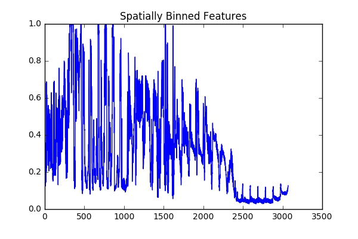
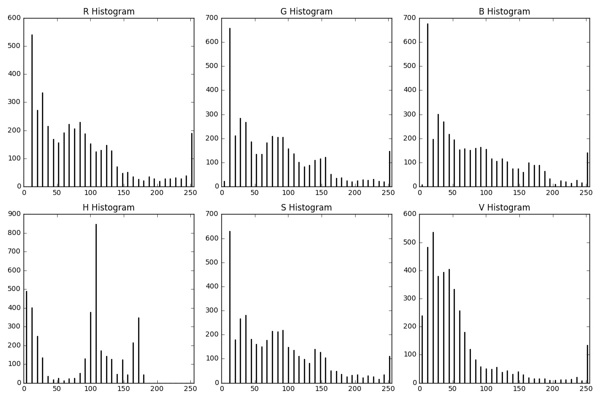
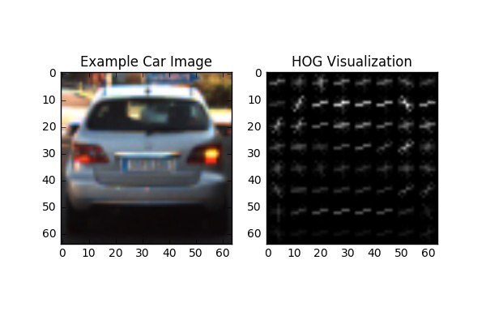
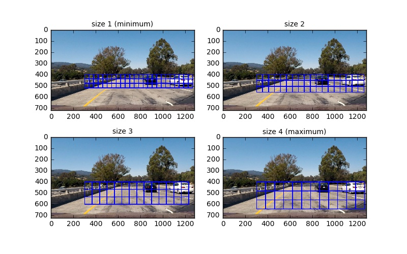
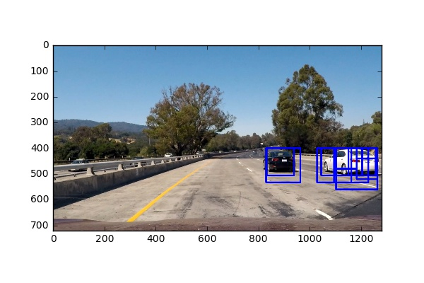
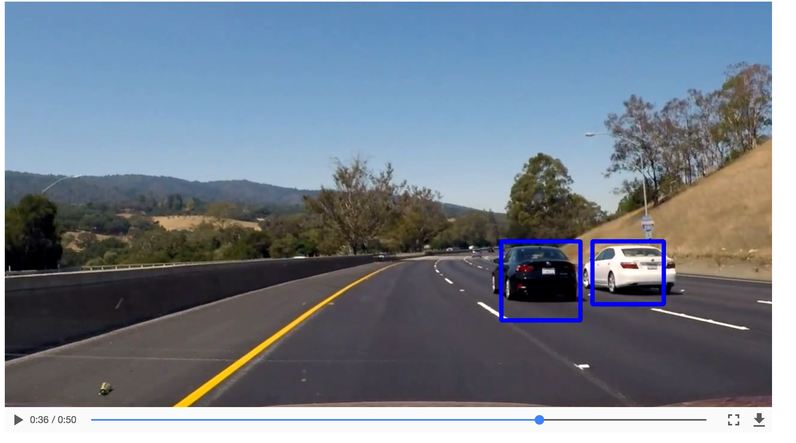

# Vehicle Detection

In this project, my goal is to write a software pipeline to detect vehicles in a video (start with the test_video.mp4 and later implement on full project_video.mp4).

The Project
---

The goals / steps of this project are the following:

* Perform a Histogram of Oriented Gradients (HOG) feature extraction on a labeled training set of images and train a classifier Linear SVM classifier
* Optionally, you can also apply a color transform and append binned color features, as well as histograms of color, to your HOG feature vector.
* Implement a sliding-window technique and use your trained classifier to search for vehicles in images.
* Run the pipeline on a video stream and create a heat map of recurring detections frame by frame to reject outliers and follow detected vehicles.
* Estimate a bounding box for vehicles detected.

## Dependencies
This project requires Python 3.5 and the following Python libraries installed:
* numpy
* opencv
* moviepy
* skimage
* sklearn

Implementation details
---
### 1. Data Preprocessing

The easiest way to do this is to investigate an image where the lane lines are straight, and find four points lying along the lines that, after perspective transform, make the lines look straight and vertical from a bird's eye view perspective(top down view).

### 2. Feature Extraction
Three types of features (2628 features in total) are used for the vehicle detection:
- Spatial features  

- Color histogram features (RGB histogram and HLS histogram)  

- Histogram of gradient (HOG) features  

Specifically, The spatial feature uses the raw pixel values of the images and flattens them into a vector.  The Color Histogram remove the structural relation and allow more flexibility to the variance of the image, which allow us to identify the different appearance of the car.  The Histogram of Gradient Orientation (HOG) is also used to capture the signature for a shape and allows variation.

### 3. Build Binary Classifier

First, I experimented with linear SVM and got a score of 0.94.  The score is not so good, and the computation to train and fine-tune SVM classifier with different kernels is non-trival. So then I implemented random forest to identify cars from non-cars, since random forest is considered one of the best out-of-box ML algorithm with few hyper-parameters.  

After grid search on the hyper-parameters, I found that model with {max_depth=25, max_features=6,  min_samples_leaf=2, min_samples_split=2, n_estimators=100} has the best score on 5-fold cross-validation.  

The Random Forest classifier was was chosen because it has a good balance of performance and speed.  It trained on 14208 images, and tested on 3552 images with 0.99 accuracy on testing set.    

### 4. Vehicle Detection
Then following techniques are used to identify and determine car part from non-car part in the image.

#### 4.1 Sliding Window Search

Sliding windows are used to extract small images for vehicle classification.  To reduce the number of searches, the search area is restricted to the lower part area (where vehicles are likely to appear).  Four sizes of search windows are used to identify cars, since cars appear to be bigger on the image when they are close to the camera, while cars appear to be smaller while they are far away from the camera.  

#### 4.2 Extract Window Features
Extract spatial features, color histogram features, and HOG features which are used for training the classifier.  
#### 4.3 Create Heatmap  
To drop the duplicates, a heatmap is built from combining the windows which have car detected.

#### 4.4 Remove Duplicates and Find Center of Car

Then a threshold is added to filter out the False Positives. From the observation on the performance of the binary classifier,  False Positives are not consistent over regions and time.  Then use 'label' to find all the disconnected areas in the heatmap.

#### 4.5 Estimate Bounding box
A bounding box is estimated by drawing a rectangular shape around the labeled area back to the original image.  

## Data
Here are links to the labeled data for [vehicle](https://s3.amazonaws.com/udacity-sdc/Vehicle_Tracking/vehicles.zip) and [non-vehicle](https://s3.amazonaws.com/udacity-sdc/Vehicle_Tracking/non-vehicles.zip) examples to train your classifier.  These example images come from a combination of the [GTI vehicle image database](http://www.gti.ssr.upm.es/data/Vehicle_database.html), the [KITTI vision benchmark suite](http://www.cvlibs.net/datasets/kitti/), and examples extracted from the project video itself.   You are welcome and encouraged to take advantage of the recently released [Udacity labeled dataset](https://github.com/udacity/self-driving-car/tree/master/annotations) to augment your training data.  

## Discussions

#### 1. Problems/Issues faced in the project

The first issue is that I got good training results on the training dataset using cross validations, but the poor result on test images from videos. This could be an overfitting issue.  I originally used the train_test_split function on the images from the same folder and get very high test accuracy (99%) with random forest.  So I shuffled the input image data randomly to ensure training, testing dataset are mixed of images from different folders. And I found my classifiers decrease accuracy by 1-3%. So, I decided to switch to a more sophisticated classifier with good running time. And I choose random forests. It gets an initial accuracy of 70% and after tuning the accuracy increase to 84 % on the test set. After the parameter tuning the classifier, the classification improvement a lot, but it still has some miss classifies.

The second problem is that there are a lot of false positives, which mean classifier identifiescars which are not there in the search box. First, I tried to use a lot of different and complicated models (overfitting issue) and tried to increase the robustness of the classifier by change the threshold probability. However, true signal may be missing if I set a higher threshold.  So, attempted to apply filtering threshold and moving average method in the heatmap of the vehicle detection. This method reduces a lot of false positives because they are not consistent (could appear and quickly disappear due to changing road/lighting/background conditions)

#### 2. Possible failures and improvements

1. Thresholds for heat-map are hard coded arbitrary, which can be improved by assigning dynamic values by learning the image/video in real time
2. The pipeline does not work well for more complicated images with cases.   Adding smoothing methods may be helpful in increasing accuracy in predicting shading cases and reduce false positive detection.
3. More real-time information may be added for analysis/diagnosis purpose.  Potentially, we could combine the lane finding methods with vehicle detection methods in real-time vehicle monitoring.
4. Deep learning may be used to improve the performance over complicated road situations.

Reference
---
- http://scikit-image.org/docs/dev/auto_examples/plot_hog.html
- https://github.com/GeoffBreemer/SDC-Term1-P5-Vehicle-Detection-and-Tracking
- https://github.com/Dalaska/CarND-P5-Vehicle-Detection-and-Tracking
